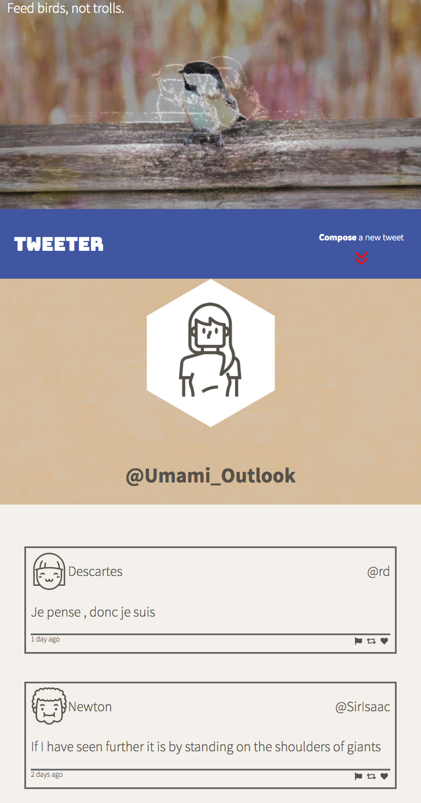
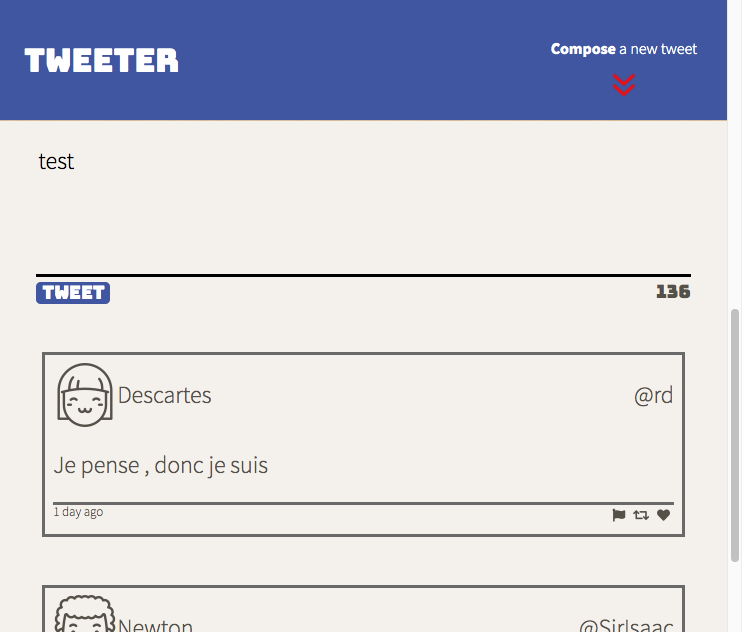
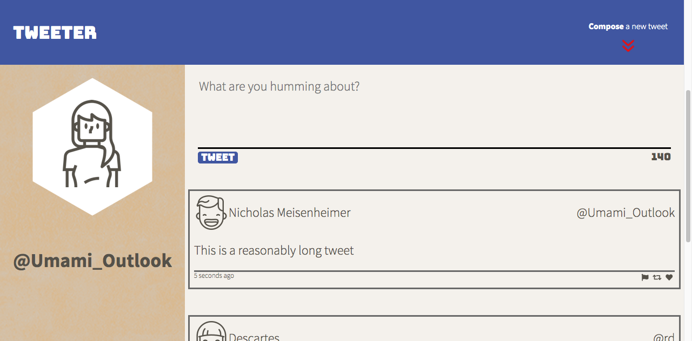
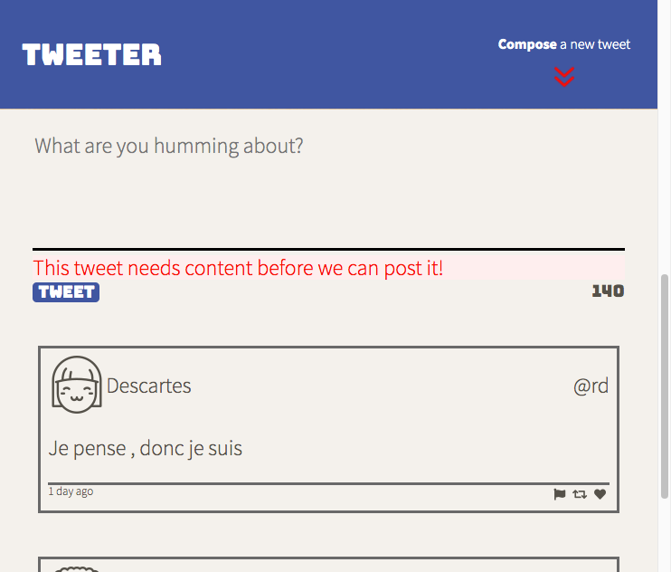
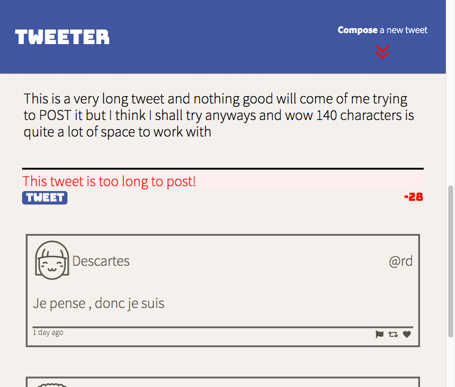
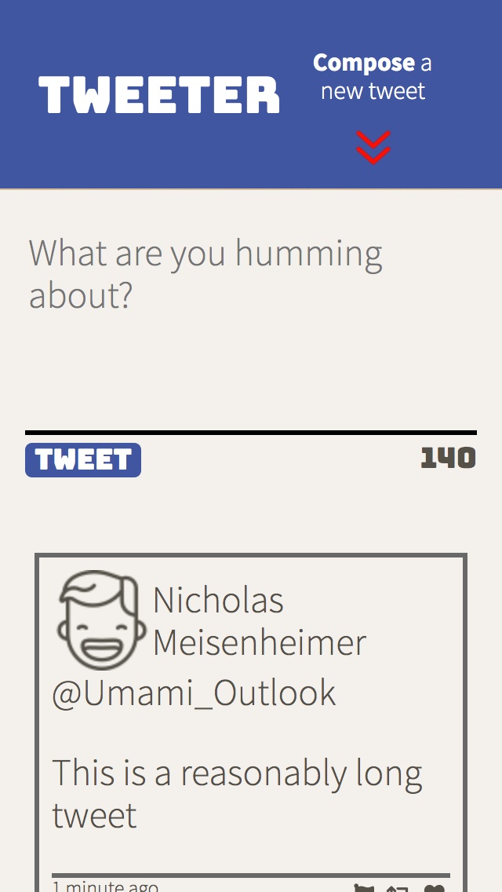
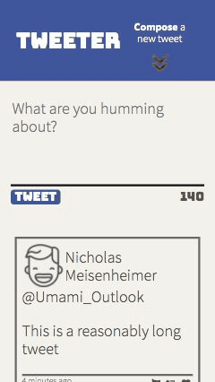

# Tweeter Project

A simple single-page AJAX based Twitter clone that uses jQuery, CSS and HTML to post and get tweets from a node server. 

Focus of this project is on comfort with responsive design, simple CSS and HTML, and some jQuery tricks for manipulating the DOM.

My personal focus for this assignment was, in no specific order:
* DRY CSS
* Using Flexbox and clever HTML architecture to enable simple responsive design with breakpoints at a width of 1024 pixels, and some small tweeks at 480 pixels.
* Clever jQuery animations - utilizing jQuery's `.promise()` - with a focus on 'jQuery-ness' (using as little built-in JS for manipulating the DOM as possible).
* Imparting a bit of my personal expression on the look of the piece.

## Getting Started

1. Fork this repository, then clone your fork of this repository.
2. Install dependencies using the `npm install` command.
3. Start the web server using the `npm run local` command. The app will be served at <http://localhost:8080/>.
4. Go to <http://localhost:8080/> in your browser.
5. Have fun!

## Screenshots

1. Column layout (responsive at widths of less than 1024px):

2. Compose drawer:

3. "Desktop mode" (responsive at widths of 1024 of greater):

4. Error handling:

5. Error handling:

6. An edge case for column layout - narrow columns with wide names (at widths of less than 480px):

7. Compose drawer scroll and open:

    

8. Return to drawer and open:

    

[gifs prepared from Chrome dev-tools performance profile JSON - learn more here!](https://hospodarets.com/demos/chrome-timeline-to-gif/) https://hospodarets.com/demos/chrome-timeline-to-gif/

## Dependencies

- Express
- Node 5.10.x or above
- jQuery
- md5
